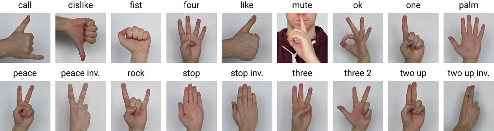

# Handwave
This project enables users to control various actions, such as changing slides in a presentation or pausing videos, by performing specific hand gestures..

## Technology
- **Front-ennd**: React, TypeScript, Vite
- **Back-end**: Electron, Sequelize, SQLite3

## Features
### Gesture Recognition:
- Recognize hand gestures using MediaPipe Hands
- Map gestures to specific actions
- Provide visual feedback for gesture recognition

### Face Landmarking:
- Track facial landmarks using MediaPipe Face Mesh
- Detect face to allow gestures from presenter only

### Cross-platform Compatibility:
- Electron enables deployment on various operating systems (Windows, macOS, Linux)